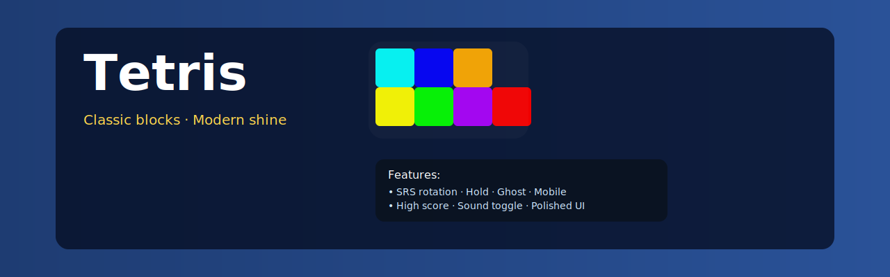
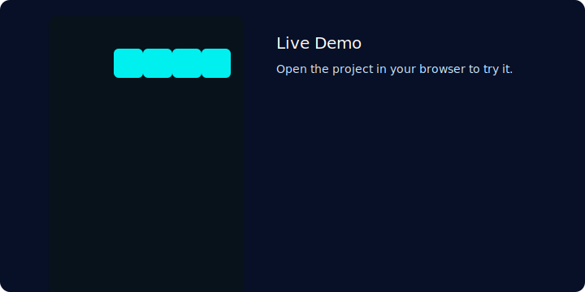
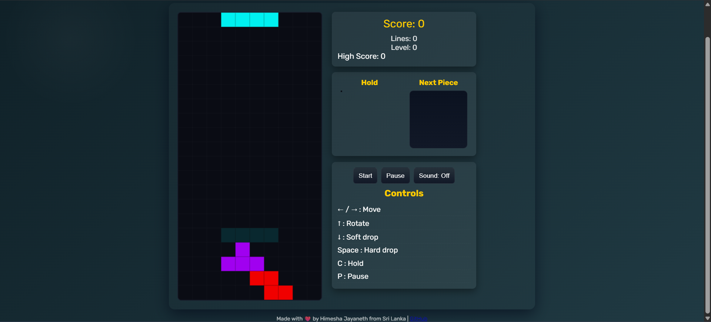
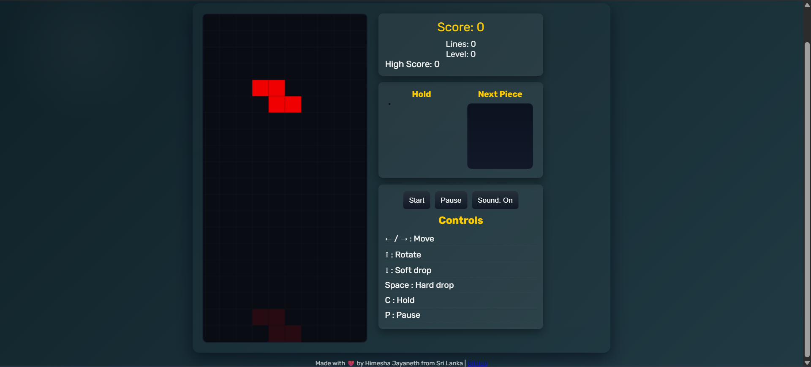
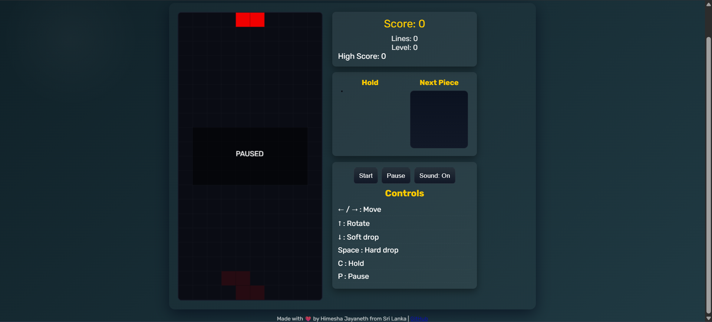

# Tetris — Classic blocks · Modern shine

<p align="center">
  
</p>

<p align="center">
  <a href="https://USERNAME.github.io/Tetris" target="_blank"></a>
  
  
  
</p>

A modern, polished Tetris built with HTML5 Canvas and vanilla JavaScript — perfect for showcasing on GitHub and as a GitHub Pages demo.

---

Live demo

- Replace `USERNAME` in the badge and link above with your GitHub username to point to the GitHub Pages demo.
- Typical GitHub Pages URL after you publish: `https://USERNAME.github.io/Tetris`

If you prefer, you can add an animated `assets/demo.gif` and swap the hero for a GIF to make the README even more engaging.

---

Quick Preview

<p align="center">
  
</p>

---

Features

- Crisp, responsive 10×20 grid rendered with Canvas
- SRS rotation with wall-kicks for smooth rotation behavior
- Hold / Swap piece (press `C`)
- Ghost piece and next-piece preview
- Soft drop, hard drop, start/pause controls
- Mobile-friendly touch controls
- WebAudio sound effects with toggle
- High score persistence via localStorage


Screenshots & Gallery

Below are screenshots from the `ss/` folder. Add more screenshots to `ss/` and they'll appear here after you update the README.

<p align="center">
  
  
  
</p>

*Tip:* To add another screenshot, put it in the `ss/` folder, commit it, and add another `` tag above (or open a PR and I'll update the README for you).


How to run locally

- Easiest: open `index.html` in your browser (double-click).
- Recommended: run a local server to ensure audio and features behave consistently.

```powershell
# from project root
python -m http.server 8000
# then open http://localhost:8000 in your browser
```

Or use Node:

```powershell
npm install -g http-server
http-server -c-1
# open the printed URL in your browser
```

Controls

- ← / → : Move piece left / right
- ↑ : Rotate (SRS rotation & wall-kicks)
- ↓ : Soft drop
- Space : Hard drop
- C : Hold / swap piece
- P : Pause / Resume
- Start button: start the game
- Sound button: toggle sound on/off
- Mobile controls: on-screen buttons for touch devices


Deploy to GitHub Pages

1. Create a GitHub repository named `Tetris` (or push this repo to `github.com/USERNAME/Tetris`).
2. Commit and push your code.
3. In the repo settings > Pages, choose the `main` branch and set the folder to `/ (root)`.
4. Save — within a minute your game will be available at `https://USERNAME.github.io/Tetris`.

Pro tip: Add `assets/demo.gif` (a short loop) to the README for the most compelling showcase.


Customization & Theming

- Colors are in `tetris.js` (edit the `COLORS` object).
- UI styles are in `style.css` — tweak gradients, fonts, and spacing.
- You can replace `assets/hero.svg` with a GIF or styled PNG for more visual impact.


Contributing

Contributions welcome — fork the repo, make a branch, and open a PR.

Ideas:
- Add music and richer SFX (file-based audio)
- Add hold animation and a multi-next queue
- Add leaderboards (server-based)
- Add curated themes (dark, neon, retro)


License

Released under the MIT License. See `LICENSE` for details.


Contact

Share a link if you publish this to GitHub Pages — I'd love to see it!

---

_Last updated: March 2, 2026_
